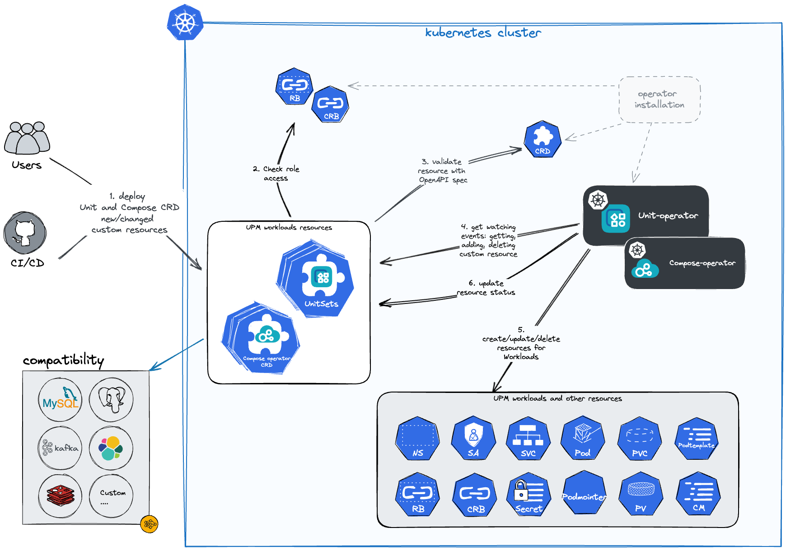

# Run Databases & Middleware in Kubernetes

Welcome to **UPMIO**, a comprehensive open source platform designed to
seamlessly manage databases and middleware within Kubernetes environments,
covering the entire operational lifecycle from initial deployment to ongoing
maintenance.

UPM (Unified Platform Management) provides cloud-native automated operations
and management capabilities for MySQL, Redis, Kafka, Zookeeper, Elasticsearch,
and other data services.

## Core Projects

### [unit-operator](https://github.com/upmio/unit-operator)

Universal workload Operator that provides Unit and UnitSet custom resources,
supporting unified orchestration and management of various databases and middleware.

### [compose-operator](https://github.com/upmio/compose-operator)

Advanced operations Operator that provides automated management for complex
operational scenarios such as MySQL master-slave replication, Redis clusters,
and ProxySQL synchronization.

### [upm-packages](https://github.com/upmio/upm-packages)

Containerization and Kubernetes deployment system for database
and middleware components. Provides production-ready Helm charts with unified
package management, security-hardened containers, and comprehensive monitoring
for MySQL, PostgreSQL, Redis, Kafka, Elasticsearch, and other data services.

## Architecture

The main task of the operator is to bring the state of the cluster in line with what is declared by the user in the custom resources. This process of constant watching and adjustment is called the “Reconciliation cycle” - it is the operator’s workflow.

The basic workflow of working with the operator can be simplified as the following diagram:

- Operator declares and owns resources of [unit-operator](https://github.com/upmio/unit-operator) & [compose-operator](https://github.com/upmio/compose-operator).
- Kubernetes validates of the resource according to the specification from CRD (see more in custom resources ).
- Operator subscribed to change events (create, update, delete) for related resources.
- When an event occurs, the operator reacts and updates the state of the objects in the cluster.
- For some objects in the cluster the reconciliation cycle is performed at a given interval, even without the occurrence of change events.

## Demo Video

Watch the complete deployment and verification process in action:

For more examples and tutorials, visit our [upm-demo](https://github.com/upmio/demo) repository.

## Contributing

We welcome contributions to all UPMIO projects! Each project has detailed contributing guidelines:

- **[unit-operator Contributing Guide](https://github.com/upmio/unit-operator/blob/main/CONTRIBUTING.md)**
- **[compose-operator Contributing Guide](https://github.com/upmio/compose-operator/blob/main/CONTRIBUTING.md)**  
- **[upm-packages Contributing Guide](https://github.com/upmio/upm-packages/blob/main/CONTRIBUTING.md)**

### Ways to Contribute

- **Report Issues**: Help us identify bugs and improvement opportunities
- **Submit Pull Requests**: Fix issues, add features, or improve documentation
- **Enhance Documentation**: Improve guides, examples, and API documentation
- **Share Knowledge**: Write blog posts, create tutorials, or speak at conferences
- **Test & Feedback**: Try new features and provide valuable feedback

## Acknowledgments

We would like to express our sincere gratitude to [Syntropy](https://www.syntropycloud.io/company/) for their valuable support and collaboration in advancing enterprise data services and open source innovation. Their commitment to partnership and collaborative innovation has been instrumental in making cutting-edge open source technologies accessible and reliable for businesses worldwide.

## License

UPMIO is licensed under the [Apache License, Version 2.0](https://github.com/upmio/.github/blob/main/LICENSE).
